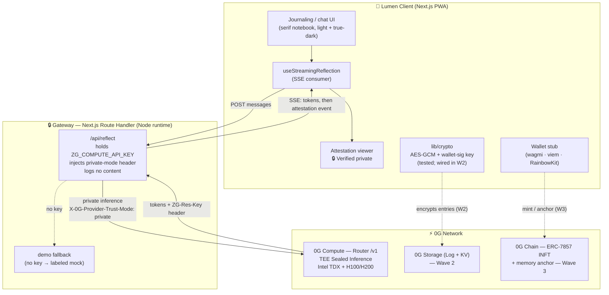

# Architecture

Lumen is a Next.js PWA whose only job is to make **provably-private** AI reflection
feel calm and trustworthy. The trust boundary for plaintext is the **client**; a
thin **gateway** keeps the 0G Compute key secret; **0G** does the privacy-bearing
work (TEE inference now; encrypted storage and on-chain ownership in later waves).

## System overview

## Data flow — one reflection (Wave 1)

1. The user writes an entry. The client builds model context = the **recent session
   turns** + the new entry (`lib/memory/session.ts`).
2. The client `POST`s the messages to `/api/reflect`.
3. The gateway prepends Lumen's system persona and calls the **0G Compute Router**
   with `stream: true` and the header `X-0G-Provider-Trust-Mode: private`. Using
   the OpenAI SDK's `.withResponse()`, it reads the `ZG-Res-Key` proof reference
   from the response headers.
4. The gateway re-streams tokens to the client as **Server-Sent Events**
   (`data: {token}` frames), then emits a final `event: attestation` carrying the
   assembled `AttestationInfo`, then `event: done`.
5. The client renders the streamed reflection with a soft caret, then shows the
   **🔒 Verified private** badge. Tapping it opens the attestation viewer (TEE
   hardware, model, proof reference, and an honest statement of what is/isn't
   proven in Wave 1).
6. If no API key is configured, steps 3–4 are served by a **clearly-labeled mock**
   so the loop always works; the badge reads *"Demo — not live TEE."*

No journal content is persisted server-side and nothing sensitive is logged.
Session memory lives only in the browser tab (no plaintext at rest) in Wave 1.

## Component responsibilities

- **Client (Next.js PWA):** all UX, the wallet stub, *all* client-side crypto
  (Wave 2), and attestation display. It is the trust boundary for plaintext.
- **Gateway (thin Route Handler):** keeps the Compute API key off the client,
  forwards inference in private mode, streams results, holds **no long-term
  plaintext** and logs no content. Honest caveat: in Waves 1–2 it sits in the
  plaintext path for the inference *call* — see [privacy-model.md](privacy-model.md).
- **0G Compute:** runs inference inside a hardware TEE; returns signed responses
  and a per-request proof reference.
- **0G Storage / Chain:** durable encrypted memory (W2) and on-chain ownership
  (W3) — scaffolded, not yet wired.

## The inference seam (why swapping is cheap)

Everything inference-related is behind `apps/web/lib/0g/compute.ts` and the
`AttestationInfo` contract in `packages/shared`. Wave 3 replaces the Router call
with the wallet-signed Direct SDK (`@0glabs/0g-serving-broker`), which unlocks
`processResponse()` per-request cryptographic verification — **without changing a
single caller or UI component.** The attestation viewer already models the
stronger `verified` state; Wave 3 just starts emitting it.

## Module map

| Path | Role |
|---|---|
| `apps/web/app/page.tsx` | Server entry — reads live/demo flag, renders the client journal |
| `apps/web/components/Journal.tsx` | Client orchestrator (composer, cards, viewer) |
| `apps/web/app/api/reflect/route.ts` | Gateway — SSE stream + attestation + demo fallback |
| `apps/web/lib/0g/compute.ts` | Inference abstraction (Router today, broker SDK in W3) |
| `apps/web/lib/0g/attestation.ts` | Single honest source for attestation wording/labels |
| `apps/web/lib/0g/chain.ts` | viem chain defs for the wallet stub |
| `apps/web/lib/hooks/useStreamingReflection.ts` | Client SSE consumer (partial-frame safe) |
| `apps/web/lib/memory/session.ts` | In-session context builder (W2 adds embeddings recall) |
| `apps/web/lib/crypto/{keys,encrypt}.ts` | AES-GCM + wallet-sig derivation (tested) |
| `packages/shared/src/*` | Verified 0G params, model catalog, shared types |
