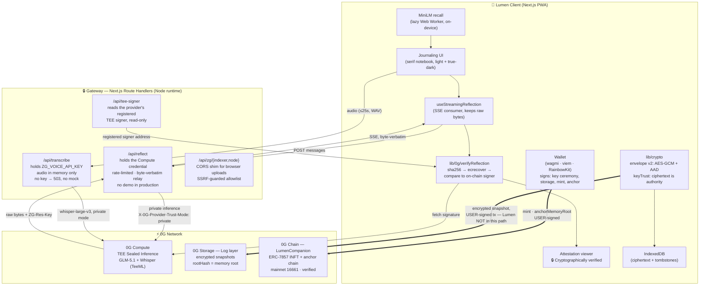

# Architecture

Lumen is a Next.js PWA whose only job is to make **provably-private** AI
reflection feel calm and trustworthy. The trust boundary for plaintext is the
**client**. A thin **gateway** keeps the 0G Compute credential secret and relays
the provider's bytes verbatim. **0G** does the privacy-bearing work: TEE
inference, encrypted storage, and on-chain ownership — all three live.

This document describes what is deployed at HEAD. Where something is planned
rather than built it says so in the same sentence.

## System overview

```mermaid
flowchart TD
    subgraph Client["📱 Lumen Client (Next.js PWA)"]
        UI["Journaling UI<br/>(serif notebook, light + true-dark)"]
        HOOK["useStreamingReflection<br/>(SSE consumer, keeps raw bytes)"]
        VERIFY["lib/0g/verifyReflection<br/>sha256 → ecrecover →<br/>compare to on-chain signer"]
        ATT["Attestation viewer<br/>🔒 Cryptographically verified"]
        CRYPTO["lib/crypto<br/>envelope v2: AES-GCM + AAD<br/>keyTrust: ciphertext is authority"]
        WALLET["Wallet<br/>(wagmi · viem · RainbowKit)<br/>signs: key ceremony, storage, mint, anchor"]
        IDB["IndexedDB<br/>(ciphertext + tombstones)"]
        RECALL["MiniLM recall<br/>(lazy Web Worker, on-device)"]
    end

    subgraph Gateway["🔒 Gateway — Next.js Route Handlers (Node runtime)"]
        PROXY["/api/reflect<br/>holds the Compute credential<br/>rate-limited · byte-verbatim relay<br/>no demo in production"]
        SIGNER["/api/tee-signer<br/>reads the provider's registered<br/>TEE signer, read-only"]
        VOICE["/api/transcribe<br/>holds ZG_VOICE_API_KEY<br/>audio in memory only<br/>no key → 503, no mock"]
        ZGPROXY["/api/zg/{indexer,node}<br/>CORS shim for browser uploads<br/>SSRF-guarded allowlist"]
    end

    subgraph ZeroG["⚡ 0G Network"]
        COMPUTE["0G Compute<br/>TEE Sealed Inference<br/>GLM-5.1 + Whisper (TeeML)"]
        STORAGE["0G Storage — Log layer<br/>encrypted snapshots<br/>rootHash = memory root"]
        CHAIN["0G Chain — LumenCompanion<br/>ERC-7857 INFT + anchor chain<br/>mainnet 16661 · verified"]
    end

    UI --> HOOK
    HOOK -->|"POST messages"| PROXY
    PROXY -->|"private inference<br/>X-0G-Provider-Trust-Mode: private"| COMPUTE
    COMPUTE -->|"raw bytes + ZG-Res-Key"| PROXY
    PROXY -->|"SSE, byte-verbatim"| HOOK
    HOOK --> VERIFY
    VERIFY -->|"fetch signature"| COMPUTE
    SIGNER -->|"registered signer address"| VERIFY
    VERIFY --> ATT
    UI -->|"audio (≤25s, WAV)"| VOICE
    VOICE -->|"whisper-large-v3, private mode"| COMPUTE
    CRYPTO --> IDB
    RECALL --> UI
    CRYPTO ==>|"encrypted snapshot,<br/>USER-signed tx — Lumen NOT in this path"| STORAGE
    WALLET ==>|"mint · anchorMemoryRoot<br/>USER-signed"| CHAIN
```

## Data flow — one reflection

1. The user writes an entry. The client builds context = the **recent session
   turns** + up to four entries chosen by **on-device recall** + the new entry
   (`lib/memory/session.ts`, `lib/memory/recall.ts`).
2. The client `POST`s the messages to `/api/reflect`. The route rate-limits by
   client key and caps message count and total characters before spending the
   credential.
3. The gateway prepends Lumen's system persona (folding any duplicate system
   message) and calls the provider with `stream: true` and
   `X-0G-Provider-Trust-Mode: private`, reading the `ZG-Res-Key` proof reference
   from the response headers.
4. **The gateway relays the provider's response bytes verbatim.** It does not
   re-frame, re-chunk or re-encode the SSE stream. This is load-bearing: the
   browser's verification hashes exactly the bytes it received, so any
   modification in transit — by the gateway or anything between — fails the
   check.
5. The client renders the streamed reflection, then verifies it: fetch the
   enclave's signature for this `chatId`, SHA-256 the raw bytes, recover the
   signing address from the signature, and compare it to the TEE signer
   registered on-chain for that provider (`/api/tee-signer`). All of this runs
   **in the browser, for every visitor, wallet or not**, within a 5-second budget
   so it never holds up the UI.
6. The badge reads **🔒 Cryptographically verified** only when all three checks
   pass. A signature that exists but does not match the bytes is an alarm state,
   not a shrug. Tapping the badge opens the viewer, which shows the recovered
   address beside the on-chain one, the signature, the hash, and an honest
   statement of what is and isn't proven.
7. The full proof triple is persisted with the turn, so the evidence outlives
   the provider's signature retention — and the JSON export carries it.
8. With no credential configured, **local dev** serves a clearly-labeled demo. A
   production deploy in that state answers **503** instead (`mayServeDemo()` in
   `lib/0g/env.ts`). Lumen never invents a reflection.

No journal content is persisted server-side and nothing sensitive is logged.
Plaintext lives only in browser memory; everything at rest — IndexedDB and 0G
Storage alike — is envelope-v2 ciphertext.

**The honest caveat, unchanged:** the gateway is still in the plaintext path for
the *inference call*. The prompt it forwards contains up to ten previously-stored
entries in cleartext. Verification is detection, not prevention. Removing the
gateway from that path is Wave 4 — see [privacy-model.md](privacy-model.md).

## Data flow — encrypted memory

1. **Unlock:** explicit user action → the wallet signs the fixed key-derivation
   message → SHA-256(sig) → non-extractable AES-GCM key, held in a ref (a
   refresh forgets it by design). The signature is obtained via `signMessage`
   from `wagmi/actions`, never the hook, so no mutation cache ever holds it.
2. **Deciding whether that key is right:** the key's authority is the user's own
   ciphertext, not a self-issued token. One authenticated decrypt of any
   wallet-bound envelope proves the key. Only when this device holds no
   ciphertext at all does the key-check value get consulted, and that path
   admits the key as **asserted** — labelled as such — rather than claiming a
   check it did not perform. Every branch lives in `lib/crypto/keyTrust.ts`.
3. **Every turn:** encrypted (AAD `lumen:v2:<keyVersion>:turn:<wallet>:<id>`) →
   IndexedDB. Embedded on-device (MiniLM worker, queued and budgeted); the
   vector is encrypted and stored beside it. A failed persist is **counted and
   surfaced**, never swallowed — an entry that only exists in React state is
   gone on refresh, and the sync chip must not say otherwise.
4. **Recall:** top-k cosine over decrypted in-memory vectors beyond the session
   window, prepended as a labeled context block. Any failure → plain session
   context; the loop never blocks on a cold model.
5. **Two tabs.** `toZg` re-reads the pointer and the stored turns from IndexedDB
   immediately before building a snapshot, so a stale tab cannot reissue a
   published `seq` or fork the chain. A `BroadcastChannel` nudge
   (`lib/storage/tabSync.ts`) then converges the other tab's *screen* — it
   carries only which wallet changed and roughly what, never journal content,
   and the receiving tab re-reads its own IndexedDB. Same-origin is not the
   same as trusted, so every message is validated before it is acted on.
6. **Delete:** a tombstone, so a delete propagates across devices through the
   snapshot chain instead of being silently resurrected by the next restore. The
   dialog refuses the words "permanently", "forever" and "erased" — a snapshot
   already on 0G cannot be unpublished by anyone, Lumen included.
7. **Save to 0G:** turns + vectors + tombstones → canonical JSON → padded to a
   power-of-two bucket → encrypted (AAD `…:snapshot:<wallet>:<seq>`, chained via
   `prevRootHash`) → **the user's wallet signs and pays** `indexer.upload` on the
   Log layer. Receipt = `{seq, rootHash, txHash}`. Lumen is not in this path;
   the `/api/zg/*` routes are a CORS shim with an SSRF-guarded allowlist, not a
   custodian.
8. **Restore:** locally from IndexedDB on re-unlock, or from any device via
   `downloadToBlob(rootHash, proof:true)` → decrypt → hydrate. A successful
   decrypt promotes an asserted key to **proven** and rewrites the KCV from
   proven material, which is what makes fresh-device recovery self-healing.
9. **Voice:** MediaRecorder → re-encoded to 16 kHz mono WAV in-browser
   (`lib/media/wav.ts`, because 0G's Whisper 400s on webm/mp4) → `/api/transcribe`
   → whisper-large-v3 (TeeML) → transcript into the composer for review. No key
   → no mic.

## Data flow — ownership and the anchor chain

1. **Mint** (`LumenCompanion.mint`) — one companion per wallet, minted to self,
   carrying the current memory root and a fixed public descriptor. User-signed.
2. **Seal** — the app's one action that both saves a snapshot to 0G Storage and
   anchors its root on-chain, with a preflight that refuses to strand a paid
   upload. `lib/0g/seal.ts` is a pure state machine; `useSeal` drives it.
3. **Anchor** (`anchorMemoryRoot(tokenId, newRoot, expectedPrevRoot)`) —
   compare-and-swap, so two devices cannot silently clobber each other.
4. **Replay** — `MemoryRootAnchored(tokenId, seq, prevRoot, newRoot)` events
   reconstruct the whole pointer history from logs (`lib/0g/anchorLogs.ts`,
   `lib/0g/anchorHistory.ts`), checked against `anchorCount` on the contract.
5. **The public proof page** (`/companion/<address>`) renders that history for
   anyone, with no wallet and no account. What it claims is bounded by what the
   logs establish — see the anchor-chain section of
   [`contracts/README.md`](../contracts/README.md) for the precise limit.

## Component responsibilities

- **Client (Next.js PWA):** all UX, the real wallet integration, *all* crypto,
  and **all verification**. It is the trust boundary for plaintext.
- **Gateway (thin Route Handlers):** keeps credentials off the client, forwards
  inference in private mode, relays bytes verbatim, holds no long-term plaintext
  and logs no content. In the plaintext path for the inference call — labelled
  in-app and in [privacy-model.md](privacy-model.md).
- **0G Compute:** runs inference inside a hardware TEE and signs the response.
- **0G Storage:** durable encrypted memory — user-signed Log-layer snapshots.
  Lumen holds no storage key.
- **0G Chain:** `LumenCompanion`, deployed and source-verified on mainnet
  (16661) and Galileo (16602) at `0x0FD618664FFAc86ef734C0C46eFF23bD73CBd738`.
  Zero admin keys, soulbound, one companion per wallet.

## The inference seam

Everything inference-related is behind `apps/web/lib/0g/compute.ts` and the
`AttestationInfo` contract in `packages/shared`. It supports both paths already:
`ZG_PROVIDER_URL` set → direct provider with an `app-sk-` token; unset → the
hosted Router with an `sk-` key. Swapping is an env change, not a code change.

Wave 3 was expected to need the Direct SDK (`@0glabs/0g-serving-broker`) for
per-request verification. It didn't — verification was implemented in the
browser over the raw bytes instead, which works for signed-out visitors and does
not put a broker in the request path. The remaining reason to want browser-direct
inference is removing the gateway from the **plaintext** path, which needs a
funded inference wallet per user. That is Wave 4.

## Module map

| Path | Role |
|---|---|
| `apps/web/app/page.tsx` | Server entry — reads live/demo flag, renders the client journal |
| `apps/web/app/companion/[address]/page.tsx` | Public, walletless proof page (ISR) |
| `apps/web/app/api/reflect/route.ts` | Gateway — rate limit, size caps, byte-verbatim SSE relay |
| `apps/web/app/api/tee-signer/route.ts` | Read-only lookup of a provider's registered TEE signer |
| `apps/web/app/api/transcribe/route.ts` | Voice gateway (Whisper TeeML, flagged, no mock) |
| `apps/web/app/api/zg/{indexer,node}` | CORS shim for browser-direct 0G Storage, SSRF-guarded |
| `apps/web/components/Journal.tsx` | Client orchestrator (composer, cards, dialogs) |
| `apps/web/components/MemoryStrip.tsx` | Key/save/anchor status surface |
| `apps/web/lib/0g/compute.ts` | Inference abstraction (direct provider or Router) |
| `apps/web/lib/0g/{verify,verifyReflection}.ts` | In-browser TEE proof verification |
| `apps/web/lib/0g/attestation.ts` | Single honest source for attestation wording |
| `apps/web/lib/0g/{companion,anchorLogs,anchorHistory}.ts` | INFT reads, log replay, chain integrity |
| `apps/web/lib/0g/{seal,practice,publicProof}.ts` | Seal state machine, practice calendar, proof page model |
| `apps/web/lib/0g/{network,chainGuard,nodeProxy,rateLimit,env}.ts` | Network params, hard seam assertion, SSRF guard, limits |
| `apps/web/lib/crypto/{keys,encrypt,canonical}.ts` | Envelope v2 (AAD), canonical JSON, padding, key versioning |
| `apps/web/lib/crypto/{keyTrust,unlockCopy,cacheAudit}.ts` | Key-trust decision table, its copy, the dev-only cache assertion |
| `apps/web/lib/hooks/useMemoryKey.tsx` | Sign-to-unlock lifecycle, trust state, recovery key |
| `apps/web/lib/hooks/useJournalMemory.ts` | Memory orchestrator: persist, hydrate, delete, save/restore/prove |
| `apps/web/lib/hooks/{useSeal,useCompanion,useAnchorArchive}.ts` | Seal run, INFT state, anchor archive |
| `apps/web/lib/hooks/useModalFocus.ts` | Focus move/trap/restore, shared by all nine dialogs |
| `apps/web/lib/memory/*` | Session context, recall, search, resurfacing, embed queue, tombstones |
| `apps/web/lib/storage/{db,snapshot,zgStorage}.ts` | Ciphertext-only IndexedDB + tombstones · snapshot codec + chain link · user-signed 0G seam |
| `apps/web/lib/storage/tabSync.ts` | Cross-tab convergence nudges — counts and ids only, never content |
| `apps/web/lib/export/bundle.ts` | Deterministic JSON/Markdown export, proof included |
| `contracts/contracts/LumenCompanion.sol` | ERC-7857 INFT, anchor chain, zero admin keys |
| `packages/shared/src/*` | Verified 0G params, model catalog, shared types |
