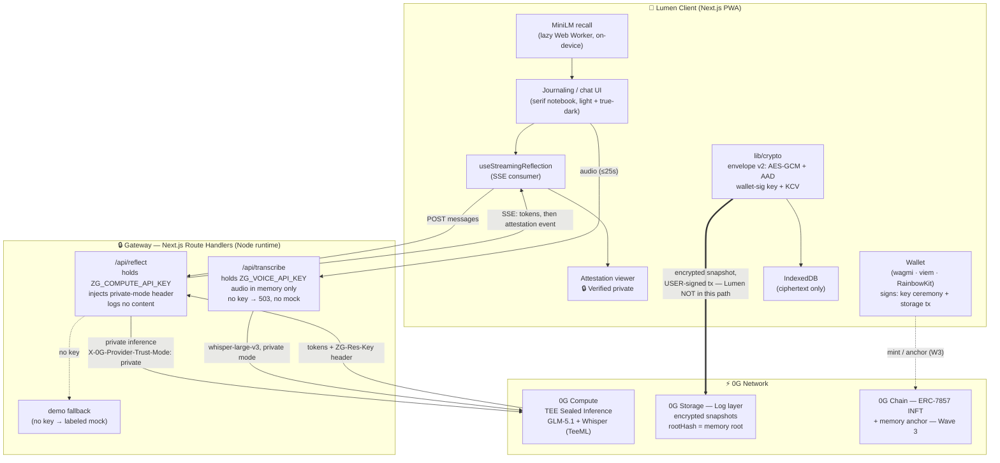

# Architecture

Lumen is a Next.js PWA whose only job is to make **provably-private** AI reflection
feel calm and trustworthy. The trust boundary for plaintext is the **client**; a
thin **gateway** keeps the 0G Compute key secret; **0G** does the privacy-bearing
work (TEE inference now; encrypted storage and on-chain ownership in later waves).

## System overview

```mermaid
flowchart TD
    subgraph Client["📱 Lumen Client (Next.js PWA)"]
        UI["Journaling / chat UI<br/>(serif notebook, light + true-dark)"]
        HOOK["useStreamingReflection<br/>(SSE consumer)"]
        ATT["Attestation viewer<br/>🔒 Verified private"]
        CRYPTO["lib/crypto<br/>envelope v2: AES-GCM + AAD<br/>wallet-sig key + KCV"]
        WALLET["Wallet<br/>(wagmi · viem · RainbowKit)<br/>signs: key ceremony + storage tx"]
        IDB["IndexedDB<br/>(ciphertext only)"]
        RECALL["MiniLM recall<br/>(lazy Web Worker, on-device)"]
    end

    subgraph Gateway["🔒 Gateway — Next.js Route Handlers (Node runtime)"]
        PROXY["/api/reflect<br/>holds ZG_COMPUTE_API_KEY<br/>injects private-mode header<br/>logs no content"]
        VOICE["/api/transcribe<br/>holds ZG_VOICE_API_KEY<br/>audio in memory only<br/>no key → 503, no mock"]
        DEMO["demo fallback<br/>(no key → labeled mock)"]
    end

    subgraph ZeroG["⚡ 0G Network"]
        COMPUTE["0G Compute<br/>TEE Sealed Inference<br/>GLM-5.1 + Whisper (TeeML)"]
        STORAGE["0G Storage — Log layer<br/>encrypted snapshots<br/>rootHash = memory root"]
        CHAIN["0G Chain — ERC-7857 INFT<br/>+ memory anchor — Wave 3"]
    end

    UI --> HOOK
    HOOK -->|"POST messages"| PROXY
    PROXY -->|"private inference<br/>X-0G-Provider-Trust-Mode: private"| COMPUTE
    COMPUTE -->|"tokens + ZG-Res-Key header"| PROXY
    PROXY -->|"SSE: tokens, then attestation event"| HOOK
    HOOK --> ATT
    PROXY -.->|no key| DEMO
    UI -->|"audio (≤25s)"| VOICE
    VOICE -->|"whisper-large-v3, private mode"| COMPUTE
    CRYPTO --> IDB
    RECALL --> UI
    CRYPTO ==>|"encrypted snapshot,<br/>USER-signed tx — Lumen NOT in this path"| STORAGE
    WALLET -. "mint / anchor (W3)" .-> CHAIN
```

## Data flow — one reflection (Wave 1)

1. The user writes an entry. The client builds model context = the **recent session
   turns** + the new entry (`lib/memory/session.ts`).
2. The client `POST`s the messages to `/api/reflect`.
3. The gateway prepends Lumen's system persona and calls the **0G Compute Router**
   with `stream: true` and the header `X-0G-Provider-Trust-Mode: private`. Using
   the OpenAI SDK's `.withResponse()`, it reads the `ZG-Res-Key` proof reference
   from the response headers.
4. The gateway re-streams tokens to the client as **Server-Sent Events**
   (`data: {token}` frames), then emits a final `event: attestation` carrying the
   assembled `AttestationInfo`, then `event: done`.
5. The client renders the streamed reflection with a soft caret, then shows the
   **🔒 Verified private** badge. Tapping it opens the attestation viewer (TEE
   hardware, model, proof reference, and an honest statement of what is/isn't
   proven in Wave 1).
6. If no API key is configured, steps 3–4 are served by a **clearly-labeled mock**
   so the loop always works; the badge reads *"Demo — not live TEE."*

No journal content is persisted server-side and nothing sensitive is logged.
Plaintext lives only in browser memory; everything at rest — IndexedDB and 0G
Storage alike — is envelope-v2 ciphertext ("no plaintext at rest", both waves).

## Data flow — encrypted memory (Wave 2)

1. **Unlock:** explicit user action → wallet signs the fixed key-derivation
   message → SHA-256(sig) → non-extractable AES-GCM key (memory only). A
   key-check value must decrypt or the UI enters a clear "mismatch" state
   (recovery key = the fallback).
2. **Every turn:** encrypted (AAD `turn:<wallet>:<id>`) → IndexedDB. The entry is
   embedded on-device (MiniLM worker, async); the vector is encrypted (AAD
   `vector:<wallet>:<id>`) and stored beside it.
3. **Recall:** before reflecting, top-k cosine over decrypted in-memory vectors
   (beyond the session window) prepends a labeled context block. Any failure →
   plain session context; the loop never blocks.
4. **Save to 0G (explicit):** all turns + vectors → canonical JSON → padded to a
   power-of-two bucket → encrypted (AAD `snapshot:<wallet>:<seq>`, chained via
   `prevRootHash`) → **the user's wallet signs and pays** `indexer.upload` on the
   Log layer. Receipt = `{seq, rootHash, txHash}`; rootHash is the memory root
   Wave 3 anchors. Lumen is not in this path.
5. **Restore:** locally from IndexedDB on re-unlock, or from any device via
   `downloadToBlob(rootHash, proof:true)` → decrypt → hydrate. "Prove I own it"
   re-downloads and decrypts fresh as a live demonstration.
6. **Voice:** MediaRecorder (≤25s) → `/api/transcribe` → whisper-large-v3
   (TeeML) → transcript into the composer for review. No key → no mic.

## Component responsibilities

- **Client (Next.js PWA):** all UX, the wallet stub, *all* client-side crypto
  (Wave 2), and attestation display. It is the trust boundary for plaintext.
- **Gateway (thin Route Handler):** keeps the Compute API key off the client,
  forwards inference in private mode, streams results, holds **no long-term
  plaintext** and logs no content. Honest caveat: in Waves 1–2 it sits in the
  plaintext path for the inference *call* — see [privacy-model.md](privacy-model.md).
- **0G Compute:** runs inference inside a hardware TEE; returns signed responses
  and a per-request proof reference.
- **0G Storage:** durable encrypted memory — user-signed Log-layer snapshots
  (live, W2). Lumen holds no storage key.
- **0G Chain:** on-chain ownership (W3) — scaffolded, not yet wired.

## The inference seam (why swapping is cheap)

Everything inference-related is behind `apps/web/lib/0g/compute.ts` and the
`AttestationInfo` contract in `packages/shared`. Wave 3 replaces the Router call
with the wallet-signed Direct SDK (`@0glabs/0g-serving-broker`), which unlocks
`processResponse()` per-request cryptographic verification — **without changing a
single caller or UI component.** The attestation viewer already models the
stronger `verified` state; Wave 3 just starts emitting it.

## Module map

| Path | Role |
|---|---|
| `apps/web/app/page.tsx` | Server entry — reads live/demo flag, renders the client journal |
| `apps/web/components/Journal.tsx` | Client orchestrator (composer, cards, viewer) |
| `apps/web/app/api/reflect/route.ts` | Gateway — SSE stream + attestation + demo fallback |
| `apps/web/lib/0g/compute.ts` | Inference abstraction (Router today, broker SDK in W3) |
| `apps/web/lib/0g/attestation.ts` | Single honest source for attestation wording/labels |
| `apps/web/lib/0g/chain.ts` | viem chain defs for the wallet stub |
| `apps/web/lib/hooks/useStreamingReflection.ts` | Client SSE consumer (partial-frame safe) |
| `apps/web/lib/memory/session.ts` | Session context builder + recall-aware variant |
| `apps/web/lib/memory/{embeddings,recall,vectorMath}.ts` | On-device MiniLM worker client + cosine top-k (pure math tested) |
| `apps/web/lib/crypto/{keys,encrypt,canonical}.ts` | Envelope v2 (AAD), canonical JSON, padding, key versioning (tested) |
| `apps/web/lib/hooks/useMemoryKey.tsx` | Sign-to-unlock lifecycle, KCV, recovery key |
| `apps/web/lib/hooks/useJournalMemory.ts` | Memory orchestrator: persist, hydrate, save/restore/prove |
| `apps/web/lib/storage/{db,snapshot,zgStorage}.ts` | Ciphertext-only IndexedDB · snapshot codec (tested) · user-signed 0G seam |
| `apps/web/app/api/transcribe/route.ts` | Voice gateway (Whisper TeeML, flagged, no mock) |
| `packages/shared/src/*` | Verified 0G params, model catalog, shared types |
